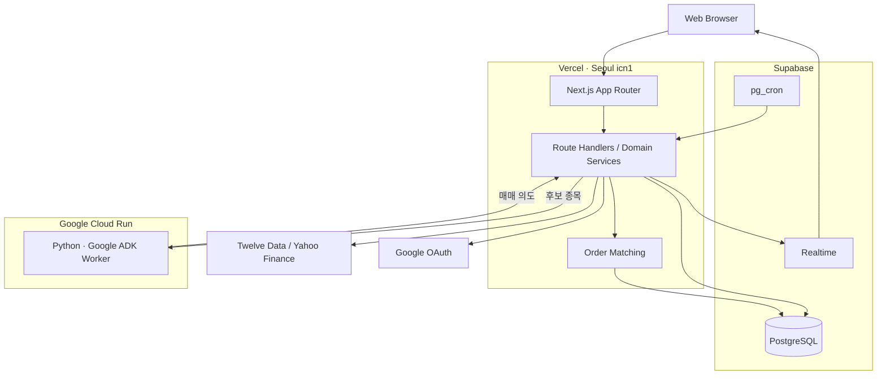

  

  <h1>Chicken Stock</h1>

  
<strong>주식을 배우고 바로 연습해 보는 모의 투자 서비스</strong>

  

    <a href="https://chicken-stock.com/"><strong>서비스 이용하기</strong></a>
    ·
    <a href="https://github.com/dyhs201231/chicken-stock/issues">이슈 제보</a>
  

  

    
    
    
    
    
  

---

## 소개

Chicken Stock은 주식 입문자를 위한 교육용 모의 투자 서비스입니다. 개념을 읽고 퀴즈를 푼 다음, 가상 계좌에서 국내·미국 주식을 거래해 볼 수 있습니다. 계좌 개설, 환전, 주문, 체결, 손익 확인까지 실제 투자에서 마주치는 과정을 한 서비스 안에 담았습니다.

모든 거래와 자산은 교육용 가상 데이터입니다. 실제 금융상품을 거래하거나 투자 자문을 제공하지 않습니다.

## 주요 기능

- **주식 학습과 퀴즈**: 초급·중급·고급 아티클, 학습 진도, 객관식·O/X·주관식 퀴즈
- **가상 계좌**: 투자 성향 진단, 증권 계좌 개설, KRW·USD 잔고와 양방향 환전
- **국내·미국 주식 거래**: 종목 검색, 호가와 캔들 차트, 시장가·지정가 주문, 미체결 주문 정정·취소
- **종목 분석**: PER·PBR, 재무제표, 실적 정보, 보유 현황과 주문 내역
- **포트폴리오**: 평가 손익, 실현 손익, 거래 내역, 예상 배당
- **AI 에이전트**: 가치·성장·모멘텀 전략에 따라 후보 종목의 매매 의도 생성

로그인하지 않아도 교육 콘텐츠와 종목 정보를 볼 수 있습니다. 진도 저장, 계좌 개설, 주문과 포트폴리오 기능은 Google 로그인이 필요합니다.

## 핵심 설계

### 중복 주문과 동시성 제어

주문 API는 멱등성 키와 요청 해시를 확인해 같은 요청이 두 번 처리되는 것을 막습니다. 체결은 PostgreSQL `SERIALIZABLE` 트랜잭션 안에서 실행하며, 종목과 포트폴리오 행을 잠가 동시에 들어온 주문이 잔고나 수량을 잘못 갱신하지 않도록 했습니다. 직렬화 충돌과 교착 상태는 정해진 횟수만큼 다시 시도합니다.

사용자 주문과 AI 에이전트 주문은 서로 다른 API로 들어오지만, 주문 조건 확인과 체결에는 같은 도메인 로직을 사용합니다.

### 외부 시장 데이터 장애 대응

시장 지수와 환율은 Twelve Data에서 먼저 조회하고, 실패하면 Yahoo Finance를 사용합니다. 요청별 timeout과 전체 시간 제한을 두고, 재시도할 때는 지수 백오프와 jitter를 적용합니다.

검증을 마친 최근 데이터는 PostgreSQL에 보관합니다. 외부 API를 사용할 수 없을 때는 유효 시간이 남은 저장 데이터를 보여주고, 화면에서 데이터 상태도 함께 안내합니다.

### AI Worker와 주문 실행 분리

AI Worker는 백엔드가 고른 후보 종목만 받아 `BUY`, `SELL`, `HOLD` 중 하나와 판단 근거를 반환합니다. 데이터베이스에 직접 접근하지 않으며, 잔고·보유 수량·장 운영 시간 확인과 주문 처리는 Next.js 백엔드가 맡습니다.

Worker 호출에 실패하면 규칙 기반 판단으로 전환합니다. 어떤 방식으로 판단했고 주문이 어떻게 처리됐는지는 로그로 남깁니다.

## 시스템 구조

웹 애플리케이션은 Vercel 서울 리전(`icn1`)에서 실행됩니다. Supabase는 데이터베이스, 실시간 이벤트, 스케줄러를 담당하고 AI Worker는 Google Cloud Run에 별도로 배포합니다.

## 기술 스택

| 구분                 | 기술                               |
| -------------------- | ---------------------------------- |
| Web                  | Next.js 16, React 19, TypeScript 5 |
| UI                   | Tailwind CSS 4, Tabler Icons       |
| 상태 관리            | TanStack Query 5, Zustand 5        |
| 차트                 | Lightweight Charts, Recharts       |
| Database             | PostgreSQL, Prisma 6               |
| Realtime / Scheduler | Supabase Realtime, pg_cron         |
| 인증                 | Google OAuth 2.0, HMAC-SHA256 JWT  |
| AI Worker            | Python 3.11, Google ADK, Gemini    |
| 배포                 | Vercel, Supabase, Google Cloud Run |

## 라이선스

[MIT License](LICENSE)
